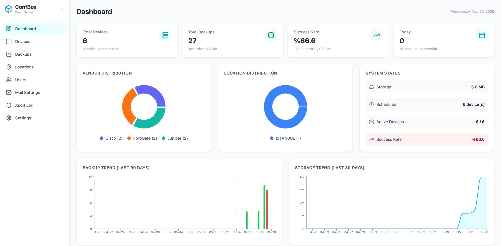

# ConfigBox — Network Configuration Backup Manager

Free, open-source network configuration backup tool for FortiGate, Cisco, Juniper, and Palo Alto devices. Automated config backups with a modern web UI, config diff comparison, email notifications, and Docker deployment in minutes.

An alternative to RANCID, Oxidized, and SolarWinds NCM — with a modern dashboard, built-in user management, and zero licensing costs.




## Supported Devices

| Vendor | Protocol | Detail |
|--------|----------|--------|
| **FortiGate** | REST API | Config backup via `/api/v2/monitor/system/config/backup` |
| **Juniper** | SSH | `show configuration | display set` |
| **Cisco** (IOS/NX-OS/ASA) | SSH | `show running-config` |
| **Palo Alto** | PAN-OS XML API | Config export via XML API |

## Features

- Automated scheduled backups (cron-based)
- One-click manual backup
- Config diff / comparison
- CSV bulk device import
- **Remote backup to S3 / Google Drive** — automatic copy to cloud storage after each backup
- **Backup archival** — automatic gzip compression of old backups to save disk space
- Dashboard statistics and trend charts
- Location-based device management
- Email notifications (success/failure/change/daily summary) with remote upload status
- Dark mode / light mode
- Multi-language support (English & Turkish)
- Role-based access control (Admin / Backup Admin)
- Two-factor authentication (TOTP)
- Comprehensive audit log
- Encrypted credentials (AES-256-CBC)
- Rate limiting
- Single binary (~30MB Docker image)
- Plain file storage — even if the app crashes, you can access configs directly from the `backups/` directory

## Quick Start

### Requirements
- Docker & Docker Compose

### 1. Clone the repository

```bash
git clone https://github.com/yunuskargi/configbox.git
cd configbox
```

### 2. Configure environment variables

```bash
cp .env.example .env
# Change the JWT_SECRET value in .env!
```

### 3. Run

```bash
docker compose up -d
```

The application will be available at `http://localhost:6161`.

### 4. Login

- **Username:** `admin`
- **Password:** `admin`

> It is recommended to change your password after first login.

## CLI Commands

```bash
# Reset a user's password
docker compose exec backend /configbox reset-password <username> <new-password>
```

## Backup File Structure

```
backups/
├── fortigate/
│   └── device-name/
│       ├── 2024-01-15_020000.conf
│       └── 2024-01-16_020000.conf
├── juniper/
├── cisco/
└── paloalto/
```

## Remote Backup (S3 / Google Drive)

ConfigBox can automatically upload a copy of each backup to S3-compatible storage (AWS, MinIO, Cloudflare R2, Backblaze B2) or Google Drive. Configure via **Settings → Remote Backup** in the web UI — setup guides are included.

## Tech Stack

| Component | Technology |
|-----------|-----------|
| Backend | Go (Chi router, sqlx, golang.org/x/crypto/ssh) |
| Frontend | React + Vite |
| Database | SQLite (WAL mode) |
| Auth | JWT + bcrypt + TOTP |
| Encryption | AES-256-CBC |
| Scheduler | robfig/cron |

## Updating / Upgrading

Your data is safe during updates:
- **Database** → stored in Docker named volume `db-data`, persists across container rebuilds
- **Config backups** → stored in `./backups` bind mount on your host, untouched during updates
- **Schema** → uses `CREATE TABLE IF NOT EXISTS`, no manual migration needed

### Update Steps

```bash
cd configbox

# Pull latest source
git pull

# Rebuild and restart (containers are recreated automatically, data is preserved)
docker compose up -d --build
```

### Important Notes

> **Do NOT change `JWT_SECRET` in `.env` after initial setup.** All device credentials (API tokens, SSH passwords) are encrypted with this key. Changing it will make existing credentials unreadable — you would need to re-enter all device passwords.

> **Do NOT delete the `db-data` Docker volume.** It contains your SQLite database with all devices, users, backup history, and settings. If you need to check: `docker volume ls | grep db-data`

> **Backup your `.env` file** before updating. If you accidentally lose it, you lose your `JWT_SECRET` and encrypted credentials cannot be recovered.

## Security

- Default login is `admin/admin` — you will be asked to change it on first login
- All credentials (device passwords, API keys, SMTP) are encrypted in the database
- If you expose ConfigBox to the internet, put a reverse proxy with SSL in front (nginx, Traefik, Caddy)
- See `.env.example` for optional settings like `ENCRYPTION_KEY`, `TRUSTED_PROXY`, and `FORCE_HTTPS`

## License

This project is licensed under [AGPL-3.0](LICENSE).

## Contributing

Pull requests and issues are welcome. For major changes, please open an issue first.
